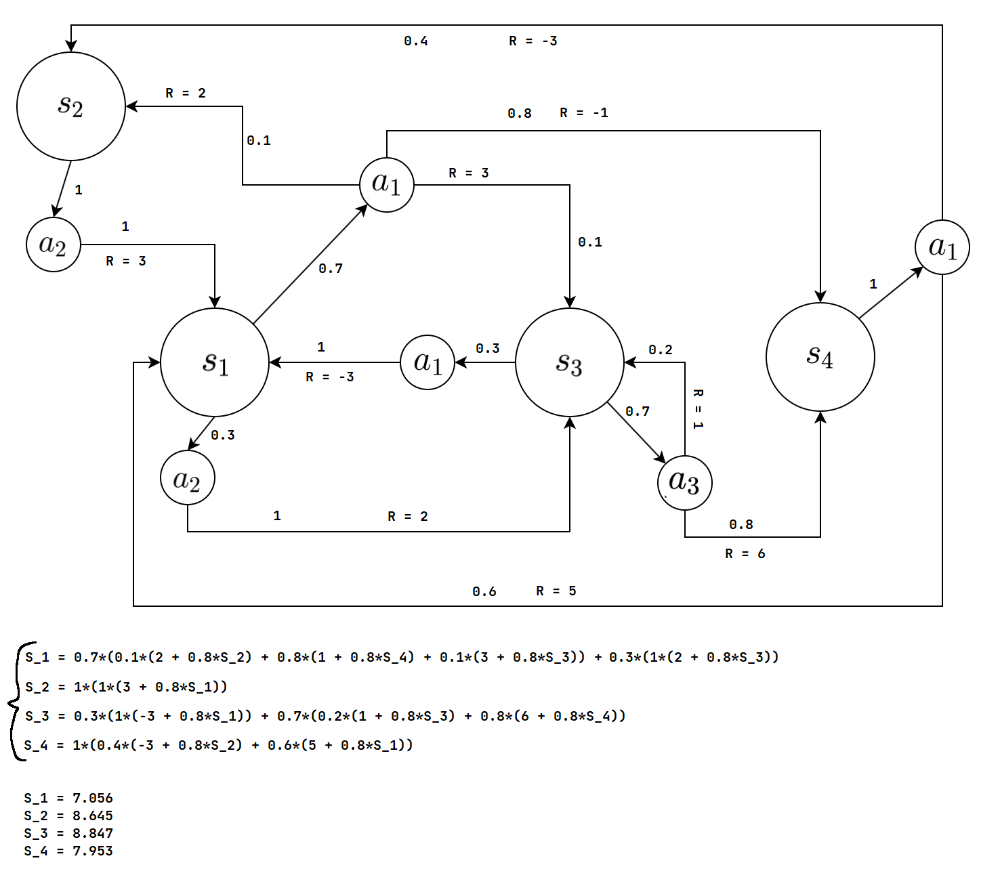

# Схема

# Система уравнений
    S_1 = 0.7*(0.1*(2 + 0.8*S_2) + 0.8*(-1 + 0.8*S_4) + 0.1*(3 + 0.8*S_3)) + 0.3*(2 + 0.8*S_3)  
    S_2 = 3 + 0.8*S_1  
    S_3 = 0.3*(1*(-3 + 0.8*S_1)) + 0.7*(0.2*(1 + 0.8*S_3) + 0.8*(6 + 0.8*S_4))  
    S_4 = 1*(0.4*(-3 + 0.8*S_2) + 0.6*(5 + 0.8*S_1))  

# Решение
[Ссылка на решение](<https://www.kontrolnaya-rabota.ru/s/equal-many/system-any/?ef-TOTAL_FORMS=52&ef-INITIAL_FORMS=2&ef-MIN_NUM_FORMS=1&ef-MAX_NUM_FORMS=1000&ef-0-s=S1+%3D+0.7*%280.1*%282+%2B+0.8*S2%29+%2B+0.8*%28-1+%2B+0.8*S4%29+%2B+0.1*%283+%2B+0.8*S3%29%29+%2B+0.3*%282+%2B+0.8*S3%29&ef-1-s=S2+%3D+3+%2B+0.8*S1&ef-2-s=S3+%3D+0.3*%281*%28-3+%2B+0.8*S1%29%29+%2B+0.7*%280.2*%281+%2B+0.8*S3%29+%2B+0.8*%286+%2B+0.8*S4%29%29&ef-3-s=S4+%3D+1*%280.4*%28-3+%2B+0.8*S2%29+%2B+0.6*%285+%2B+0.8*S1%29%29&ef-4-s=&ef-5-s=&ef-6-s=&ef-7-s=&ef-8-s=&ef-9-s=&ef-10-s=&ef-11-s=&ef-12-s=&ef-13-s=&ef-14-s=&ef-15-s=&ef-16-s=&ef-17-s=&ef-18-s=&ef-19-s=&ef-20-s=&ef-21-s=&ef-22-s=&ef-23-s=&ef-24-s=&ef-25-s=&ef-26-s=&ef-27-s=&ef-28-s=&ef-29-s=&ef-30-s=&ef-31-s=&ef-32-s=&ef-33-s=&ef-34-s=&ef-35-s=&ef-36-s=&ef-37-s=&ef-38-s=&ef-39-s=&ef-40-s=&ef-41-s=&ef-42-s=&ef-43-s=&ef-44-s=&ef-45-s=&ef-46-s=&ef-47-s=&ef-48-s=&ef-49-s=&ef-50-s=&ef-51-s=&X=x&x1=-10&x2=10&Y=y&y1=-10&y2=10>)

# Ответ
    s1 = 7.055946025371014  
    s2 = 8.644756820296811  
    s3 = 8.847353622908308  
    s4 = 7.953176274673067  
